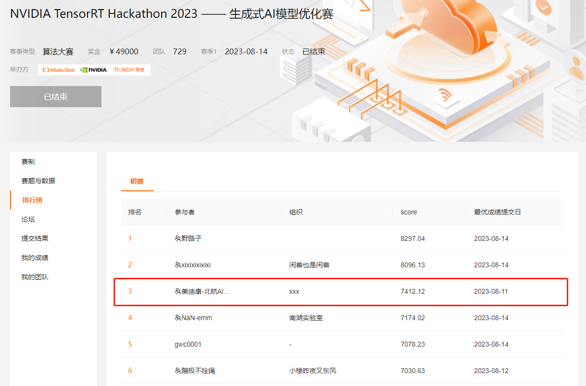

##  天池 NVIDIA TensorRT Hackathon 2023 —— 生成式AI模型优化赛 

###  初赛 第三名 比赛方案  

美迪康-北航AI Lab

+ https://tianchi.aliyun.com/competition/entrance/532108/introduction

### 大赛介绍

TensorRT 作为 NVIDIA 英伟达 GPU 上的 AI 推理加速库，在业界得到了广泛应用与部署。与此同时，TensorRT 开发团队也在持续提高产品的好用性：一方面让更多模型能顺利通过 ONNX 自动解析得到加速，另一方面对常见模型结构（如 MHA）的计算进行深度优化。这使得大部分模型不用经过手工优化，就能在 TensorRT 上跑起来，而且性能优秀。

过去的一年，是生成式 AI（或称“AI生成内容”） 井喷的一年。大量的图像和文本被计算机批量生产出来，有的甚至能媲美专业创作者的画工与文采。可以期待，未来会有更多的生成式AI模型大放异彩。在本届比赛中，我们选择生成式AI模型作为本次大赛的主题。

今年的 TensorRT Hackathon 是本系列的第三届比赛。跟往届一样，我们希望借助比赛的形式，提高选手开发 TensorRT 应用的能力，因此重视选手的学习过程以及选手与 NVIDIA 英伟达专家之间的沟通交流。我们期待选手们经过这场比赛，在 TensorRT 编程相关的知识和技能上有所收获。

### 初赛补充说明

- 初赛仅提供测评服务器不提供开发机，参赛选手需要自备带有 GPU 的 Linux / Windows 11 (WSL2) 开发机，并在给定 docker 中用赛方提供的模型文件、开发工具完成模型在 TensorRT 中的构建、运行、精度验证和性能测试，并将代码提交至指定仓库以供测评服务器打分排名。
- 初赛使用的镜像：`registry.cn-hangzhou.aliyuncs.com/trt-hackathon/trt-hackathon:v2`
  - 该镜像基于NVIDIA 英伟达官方镜像扩充而来，包含 CUDA 11.8，TensorRT 8.6.1 以及比赛用到的开发工具、模型文件、测试样例数据。请根据"配置开发环境"部分的说明进行使用。
  - 初赛不会提供 ONNX 模型，选手需要自行完成 PyTorch 到 TensorRT 的全部转换过程
  - 初赛使用 Perceptual Distance (PD) 评估生成图片的质量，/home/player/ControlNet/compute_score.py 已包含 PD score 的计算方法，即 TensorRT 生成图片与 PyTorch FP32 生成图片之间的差异程度，PD score 越小越好
  - 初赛包含 Clip 、 UNet 、 ControlNet 、VAE Encoder 和 Decoder 等较多模型，时间有限的话可以优先优化 UNet 和 ControlNet 模型
  - 与去年不同，本次初赛优化的是包含多次迭代的 pipeline，除了对单个模型的优化，还可以尝试 pipeline 层次的加速，以获取更高分数
- 代码验证与提交
  - 请保证在 docker 里能正常运行你的代码，并且无论编译时还是运行时，都不依赖网络下载任何代码或数据，即代码需要是完整的、自包含的。如果确实需要在 docker 里面新增开发库或软件，请在交流群里反应给赛方，我们将添加到比赛用的 docker image 中
  - 比赛所需代码在 /home/player/ControlNet 目录下。 canny2image_TRT.py 文件中是需要加速的canny2image PyTorch pipeline。请修改其中的initialize（） 与 process（）函数来加速pipeline。（不要更改函数名称与参数表）每调用一次process 函数就需要能够生成一张新的图片。 计分程序会以process函数运行时间与生成图片与原始torch pipeline 生成图片之间的差距来决定分数。
  - 在使用TRT 加速pipeline 的过程中，选手会需要将PyTorch 中的模型转换为TRT engine。请将这个转换过程的脚本写入 [preprocess.sh](http://preprocess.sh/)。 所有的中间文件请不要上传到git repo。 计分程序运行canny2image_TRT.py [前会先运行preprocess.sh](http://xn--preprocess-cy4pi3s5sdj39yttxa.sh/) 在本地生成TRT engine。[所有preprocess.sh](http://xn--preprocess-yy8tp95b.sh/) 会产生的中间文件（比如 .onnx, .plan, .so）请放到 ControlNet/ 目录下。 请不要使用绝对路径（使用相对路径时，[根目录为preprocess.sh](http://xn--preprocess-xx2p955nmfya9u9b.sh/) 所在地址 ）， 因为计分程序会clone 代码到新的地址进行测试。
  - 选手可以通过运行 compute_score.py 来预估运行时间和结果误差情况，其中调用process的参数大部分与计分程序使用的参数相同（除了 random seed 与 prompt），计分程序会使用不同的seed，prompt 来进行测试。最终测试图片大小为256x384。测试图片示例在/home/player/pictures_croped/ 文件夹中。
  - 正式提交前，请验证代码已符合要求：
    - 把 /home/player/ControlNet 作为代码根目录，包含完整代码
    - 运行 /home/player/ControlNet/preprocess.sh，检查 ~/ControlNet下面的 .onnx .plan 和 .so 是否正常生成
    - 运行 /home/player/ControlNet/compute_score.py，检查 pipeline 是否正常生成图片，并确认在标准输出得到PD score
    - 在docker 外面clone 代码， 确保代码可以以一下方式运行
      - docker run --rm -t --network none --gpus '0' --name hackathon -v /repo/anywhere:/repo [registry.cn-hangzhou.aliyuncs.com/trt-hackathon/trt-hackathon:v2](http://registry.cn-hangzhou.aliyuncs.com/trt-hackathon/trt-hackathon:v2) bash -c "cd /repo && bash [preprocess.sh](http://preprocess.sh/)"
      - docker run --rm -t --network none --gpus '0' --name hackathon -v /repo/anywhere:/repo [registry.cn-hangzhou.aliyuncs.com/trt-hackathon/trt-hackathon:v2](http://registry.cn-hangzhou.aliyuncs.com/trt-hackathon/trt-hackathon:v2) bash -c "cd /repo && python3 compute_score.py"
  - 验证通过后提交代码：
    - 在 [https://gitee.com/](https://gitee.com//) 上创建代码仓库，设为私有，并把 xueli1993 加为开发者
    - 借助 git 将自己的代码上传到代码仓库
    - 把仓库的 git 地址填入天池提交页，正式提交
    - 首次提交代码时，请在天池页面点击“提交结果”->“修改地址”，在弹出的窗口中“git路径”中，请写入可用 git clone 命令顺利下载代码的URL
    - 请不要提交大文件 (.onnx .plan. so等) 到git，测试代码时不会使用git-lfs clone代码。
- 排名依据
  - 优化后模型将在评测服务器上 GPU（A10）运行，得分考虑两个方面，即结果精度（PD score，大于12 为精度不合格）和推理时间（end-to-end 耗时）两方面
  - 得分与推理时间负相关，与PD score也负相关
  - 选手可以通过在自己开发机上运行 compute_score.py 来预估运行时间和结果误差情况。但注意实际评测是在评测服务器上完成的，不采用本地开发机上报告的结果
  - 对于成绩相同的选手，按提交时间较早的排名靠前。
  - 天池的在线排行榜并非实时更新，而是每隔一段时间更新，它未考虑运行时间的测量误差以及提交时间早晚，其结果仅供参考，初赛结束时赛方将给出最终排行榜。

### 比赛使用的Trick

| 使用的Trick                                                  | 分数      | 时间                |
| ------------------------------------------------------------ | --------- | ------------------- |
| CLIP(Pytorch FP32)+VAE(FP16)+ControlNet(FP16)+UNet(FP16)     | 4883.3085 | 2023-08-03 10:20:25 |
| CLIP(TensorRT FP32)+VAE(FP16+后处理 BS=2)+ControlNet(FP16 BS=2)+UNet(FP16 BS=2)   No CudaGraph | 5156.8650 | 2023-08-04 01:06:32 |
| CLIP(TensorRT FP32)+VAE(FP16+后处理 BS=2)+Combine (FP16 BS=2) + DDIM PostNet(FP32)  Add CudaGraph + GrroupNorm Plugin | 5434.8283 | 2023-08-05 17:52:20 |
| CLIP(TensorRT FP16)+VAE(FP16+后处理 BS=2)+Combine (FP16 BS=2) + DDIM PostNet(FP32)  Add CudaGraph DDIM PostNet No CudaGraph + GroupNorm Plugin | 5570.2850 | 2023-08-05 20:50:43 |
| CLIP(TensorRT FP16)+VAE(FP16+后处理 BS=2)+Combine (FP16 BS=2) + DDIM PostNet(FP32)  Add CudaGraph DDIM PostNet No CudaGraph + GroupNorm Plugin  + step=10 | 6892.1675 | 2023-08-08 00:15:29 |
| CLIP(TensorRT FP16)+VAE(FP16+后处理 BS=2)+Combine (FP16 BS=2) + DDIM PostNet(FP32)  Add CudaGraph DDIM PostNet No CudaGraph + GroupNorm Plugin  + step=10 + 代码逻辑优化 | 7149.9667 | 2023-08-10 07:41:51 |
| CLIP(TensorRT FP16)+VAE(FP16+后处理 BS=2)+Combine (FP16 BS=2) + DDIM PostNet(FP32)  Add CudaGraph DDIM PostNet No CudaGraph + GroupNorm Plugin  + step=9 + 代码逻辑优化 | 7412.1161 | 2023-08-11 06:47:07 |

最终初赛排名第三：

### 比赛过程中的无用的尝试

Plugin对Latency无用的尝试：

+ LayerNorm Plugin 无用
+ InstananceNorm Plugin 无用
+ Attention Plugin 无用
+ multiHeadFlashAttentionPlugin无用
+ multiHeadFlashCrossAttention Plugin无用
+ seqLen2DpatialPlugin无用
+ splitGelu Plugin无用

代码上的尝试：

+ Multi stream无用，不如batch size=2

> TensorRT 8.6将SD中的一些优化Trick集成到了内部，留给开发者的优化远没有TensorRT8.5要多。

### Demo

|                      |                      |                       |                       |
| -------------------- | -------------------- | --------------------- | --------------------- |
|  |  |  |  |

